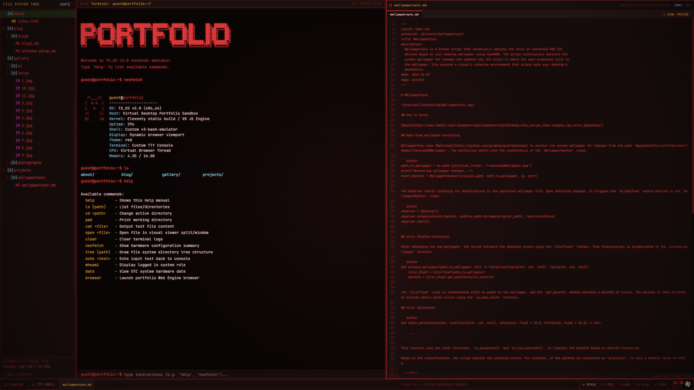

# Tasrif's Portfolio



- [**Live Site**](https://zephyr73.github.io)

---

## Sparse-Checkout Clone (For Laptops)

To clone only the content folders onto your laptop to publish content on the go:

1.  Initialize a sparse checkout:
    ```bash
    git clone --no-checkout https://github.com/Zephyr73/zephyr73.github.io.git
    cd zephyr73.github.io
    git sparse-checkout init --cone
    git sparse-checkout set src/v2/blog src/v2/projects src/assets/img
    git checkout main
    ```
2.  Add/edit posts locally, then commit and push:
    ```bash
    git add .
    git commit -m "Add new blog post"
    git push origin main
    ```

---

## Local Development

Run commands from the repository root:

- **Start Dev Server**: `npm run dev` (Runs eleventy server and watches Tailwind CSS).
- **Compile CSS**: `npm run build:css` (Compiles styling manually).
- **Production Build**: `npm run build` (Generates the static site inside `_site/`).
- **Lint Check**: `npm run lint:js` (Checks JavaScript files for errors).

---

## License

This repository is dual-licensed:

- **Source Code**: [MIT License](LICENSE) (Free to fork and modify).
- **Photography & Generative Art** (`src/_gallery_source/`, `src/assets/img/`): [CC BY-NC 4.0](LICENSE-CONTENT) (Free to share and modify with attribution, non-commercial use only).
